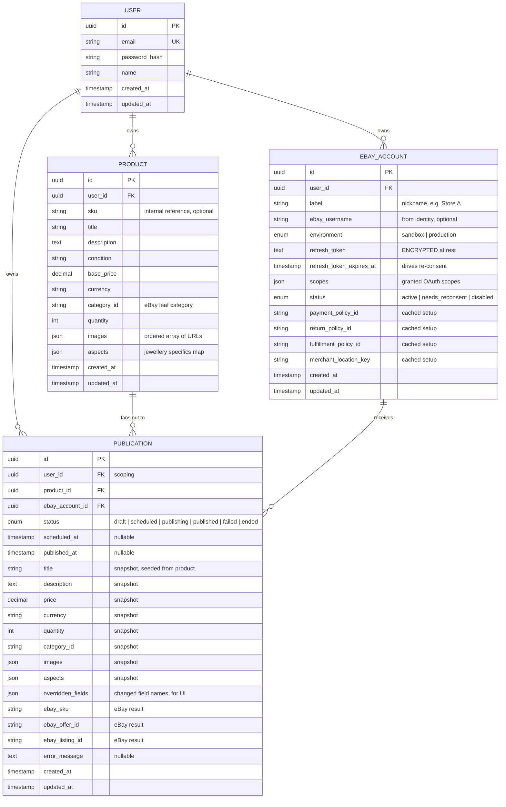

# Listing Tool — Data Schema

Jewellery multi-account eBay listing tool. Store one master product, publish it to
many linked eBay accounts with per-publish overrides. Single-SKU products,
per-publish full snapshots, normal email+password auth, scope = publishing +
scheduling only.

> Column types below are indicative (DB-agnostic). Final types get pinned once the
> stack/DB is chosen.

## ER diagram

## Notes

- **Ownership / scoping**: every `ebay_account`, `product`, and `publication` belongs
  to a `user`. `publication.user_id` is denormalized so we can query "everything for
  this user" directly.
- **Publication = full snapshot**: the listing content (title, price, images, aspects,
  …) is copied onto the publication, seeded from the product and individually
  overridable. Past publications are immune to later product edits; clear audit of
  exactly what was listed where.
- **No (product, account) uniqueness**: we keep history and allow re-listing, so a
  product can have many publication rows per account over time.
- **Key queries**: publications by account, by user, by status (e.g. all `scheduled`,
  all `published`), by product.
- **Security**: `ebay_account.refresh_token` is encrypted at rest.
- **Out of scope (for now)**: inventory/quantity sync, orders/sales, multi-variation
  listings, fan-out batch grouping. A category/required-aspects cache table may be
  added when wiring up the Taxonomy API.
